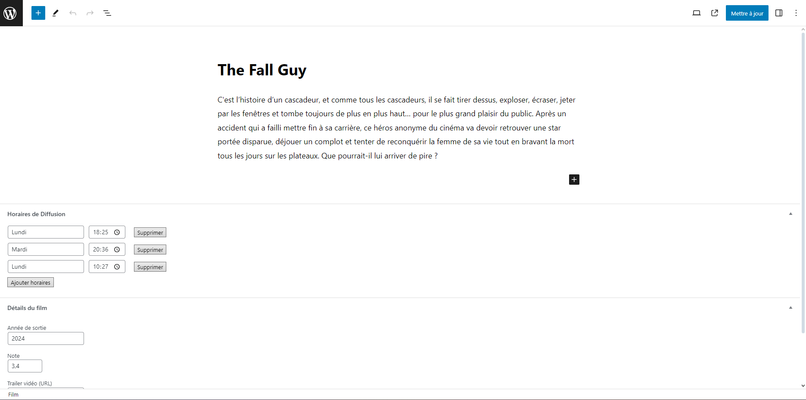

Compte admin :

- login : admin
- mdp : cMX2F5mrp4y93K

# Utilisation du plugin "cinema-schedule"

## Première manière

- Se rendre sur la page "Horaires de films"
- Lors de l'édition d'une diffusion de film, si plusieurs horaires sont définies, il sera alors possible de choisir celle à modifier.
- Si vous souhaitez par l'ajout d'une horaire alors qu'une ou plusieurs diffusions sont déjà existantes pour ce film alors ils se supprimeront toutes si l'ajout est "Enregistrer".
- Le jour est à préciser manuellement à la différence de l'heure.

## Seconde manière

- Des champs personnalisés ont été ajoutés dans l'édition d'un film afin d'ajouter une possibilité de gérer les diffusions.
- Chaque diffusion ajoutée dans cette partie est en lien avec la page "Horaires des films" et inversement.
  
